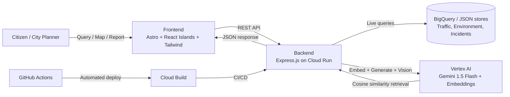

# 🏙️ CityPulse

**An AI-powered Decision Intelligence Platform for smarter, healthier cities.**

Built for **Gen AI Academy APAC — "AI for Better Living and Smarter Communities"**
Team: **Infinite Parallax**

> CityPulse turns raw urban data — traffic congestion, air quality, and city corridor telemetry — into natural-language answers, forecasts, and actionable recommendations for city planners and citizens alike. Ask it a question the way you'd ask a colleague: *"Which corridors will be worst hit during evening peak, and where should we prioritize?"*

> 🛡️ **Responsible AI:** CityPulse is a decision-**support** tool with a human in the loop — see [RESPONSIBLE_AI.md](RESPONSIBLE_AI.md) for data provenance (synthetic vs. real), model limitations, and the human-approval requirement before any action is dispatched.

---

## Table of Contents

- [Problem Statement Fit](#-problem-statement-fit)
- [Features](#-features)
- [Architecture](#-architecture)
- [Google Cloud Integration](#-google-cloud-integration)
- [Tech Stack](#️-tech-stack)
- [Local Setup](#-local-setup)
- [Project Structure](#-project-structure)
- [Screenshots](#-screenshots)
- [Live Demo](#-live-demo)
- [Roadmap](#-roadmap)
- [Team](#-team)

---

## 🎯 Problem Statement Fit

The challenge asks for a platform that helps **individuals, communities, organizations, and city stakeholders** turn data from **transportation, environmental monitoring, and citizen feedback** into decisions — using **conversational AI, RAG, and predictive analytics**.

| Challenge requirement | How CityPulse addresses it |
|---|---|
| Understand & analyze multi-source city data | Live traffic congestion + Air Quality Index (AQI) data, unified in one dashboard |
| Answer questions in natural language | **"Ask the City"** — a Gemini-powered conversational interface |
| Identify patterns and anomalies | Automatic anomaly detection on severe congestion and incident spikes |
| Predict outcomes | Forecasting model projecting near-term congestion trends |
| Support decision-making with AI assistance | LLM-generated, context-grounded recommendations for planners |
| Urban mobility *and* environmental sustainability | Both solution areas addressed in a single unified platform, not siloed tools |

---

## 🚀 Features

- **Live Congestion & AQI Map** — dark-mode, MapLibre-powered real-time view across 5 major city corridors (demo city: Lucknow), including a toggleable Public Safety incident layer.
- **KPI Dashboard** — live trend charts for congestion levels and delay times, built with Recharts.
- **Anomaly Detection & Alerts** — automatic flagging of severe congestion and public safety incident rate spikes using a shared statistical baseline engine.
- **"Ask the City" (Cross-Domain RAG)** — natural-language query bar powered by Vertex AI Gemini, grounded via vector embeddings + cosine-similarity retrieval over live mobility, environment (Livability Scores), and public safety data.
- **AI Forecasting & Recommendations** — trend-based Holt-Winters forecasting with uncertainty bands, combined with LLM-generated, data-grounded recommendations for city planners.
- **Decision Loop (Action Center & Citizen Reporting)** — AI-drafted Action Memos triggered by anomalies, and a Citizen Report intake that uses Gemini Vision to classify photo-based submissions. 
  - *Honest Stub Note*: Dispatching an Action Memo currently updates the internal status and timestamp; it does not yet send real SMS/emails or connect to live municipal systems to prevent accidental real-world triggers.

---

## 🏗 Architecture



**Flow:** the frontend sends a query (or citizen report) → backend processes it (using Gemini Vision for classification, or embeddings for RAG retrieval over multiple domains) → the retrieved context plus raw metrics are passed to Gemini 1.5 Flash on Vertex AI → the model returns a grounded natural-language answer, recommendation, or drafted Action Memo → rendered live on the dashboard.

---

## ☁️ Google Cloud Integration

| Service | Role in CityPulse |
|---|---|
| **Vertex AI** | `gemini-1.5-flash` via `@google-cloud/vertexai` SDK for natural-language Q&A, recommendations, and embedding generation |
| **BigQuery** | Live querying of traffic and environmental data (with a local JSON fallback for offline development) |
| **Firestore** | Persistent storage for citizen reports and action memos, replacing local JSON/in-memory state (with offline fallbacks) |
| **AlloyDB** | `pgvector` vector store for RAG retrieval (OLTP + vector search in one service, vs. BigQuery which is OLAP-only) |
| **Cloud Run** | Containerized backend deployment target |
| **Cloud Build** | Automated build pipeline, triggered via GitHub Actions |

We deliberately avoided the direct Gemini Developer API (API-key auth) in favor of Vertex AI (GCP-project + service-account auth) so the platform is verifiably billed and traceable as a Google Cloud workload, not just "an app that calls an LLM."

---

## 🛠️ Tech Stack

**Frontend:** Astro, React 19, Tailwind CSS, Zustand, MapLibre GL, Recharts
**Backend:** Express.js (Node), Jest for testing
**AI/Data:** Vertex AI (Gemini 1.5 Flash + embeddings), BigQuery
**Infra:** Docker, Cloud Run, Cloud Build, GitHub Actions

---

## 🚦 Local Setup

### 1. Clone the repository
```bash
git clone https://github.com/Team-Infinite-Parallax/citypulse.git
cd citypulse
```

### 2. Install dependencies
```bash
cd frontend && npm install
cd ../backend && npm install
```

### 3. Authenticate with Google Cloud (required for Vertex AI / BigQuery)
```bash
gcloud auth application-default login
```

### 4. Configure environment variables
Create a `.env` file inside `backend/`:
```env
PORT=3001
GCP_PROJECT_ID=your-google-cloud-project-id
USE_BIGQUERY=false   # set to true once you've run the BigQuery init script
```

### 5. Run the application
```bash
# Terminal 1 — backend
cd backend && npm run dev

# Terminal 2 — frontend
cd frontend && npm run dev
```

### 6. Open the app
Visit **http://localhost:4321** in your browser.

---

## ☁️ Deployment (Backend on Render & Frontend on Vercel)

This project is configured to host the **Express backend on Render** and the **Astro frontend on Vercel**.

### 1. Backend Deployment (Render)
The backend can be automatically deployed to Render using the bundled [render.yaml Blueprint](file:///d:/infinite%20parallax/web/citypulse/render.yaml).

1. Push your repository to GitHub.
2. Log in to the [Render Dashboard](https://dashboard.render.com).
3. Click **New** -> **Blueprint**.
4. Connect your GitHub repository.
5. Render will automatically detect the blueprint and set up **`citypulse-backend`** (a Node Express Web Service).
6. During setup, configure the following environment variables:
    *   `CORS_ORIGIN`: Set to your frontend's Vercel deployment URL (e.g., `https://citypulse.vercel.app`).
    *   `GCP_PROJECT_ID`: (Optional) Your Google Cloud project ID if using Vertex AI, BigQuery, or Firestore. If left blank, the backend automatically runs in offline local-fallback mode using bundled JSON caches.

### 2. Frontend Deployment (Vercel)
The frontend is pre-configured with the `@astrojs/vercel` adapter, allowing Astro to deploy as a serverless SSR application on Vercel.

1. Connect your repository to **Vercel**.
2. Vercel will automatically detect the Astro framework, configure the build command (`npm run build`), and set the output directory to `dist`.
3. Set the following environment variable in the Vercel project configuration:
    *   `PUBLIC_API_URL`: The public URL of your deployed Render backend (e.g., `https://citypulse-backend.onrender.com`).
4. Click **Deploy**.

---

## 📁 Project Structure

```
citypulse/
├── frontend/          # Astro + React 19 dashboard, map, and query UI
├── backend/           # Express API — RAG, forecasting, Vertex AI + BigQuery integration
├── graphify-out/       # Generated project knowledge graph (dev tooling)
├── .github/workflows/  # CI/CD — GitHub Actions → Cloud Build
├── citypulse_audit.md  # Internal technical self-audit against hackathon rubric
└── README.md
```

---

## 📸 Screenshots

*(Add dashboard, map view, and "Ask the City" query screenshots here before submission — this is one of the fastest wins for judge-facing polish.)*

---

## 🎥 Live Demo

*(Add deployed Cloud Run / hosting URL and a 2–3 minute walkthrough video link here.)*

---

## 🗺️ Roadmap

- [ ] Second live domain: citizen feedback intake (pothole / signal fault / streetlight reporting), classified via Gemini
- [ ] Health-impact advisory layer cross-referencing AQI + congestion for vulnerable-group guidance
- [ ] Cloud Scheduler job for automated periodic data refresh
- [ ] Role-based views (citizen vs. city-stakeholder)
- [ ] Multi-step agentic workflows (ADK) for compound planner queries

---

## 👥 Team — Infinite Parallax

*(Add team member names / roles here.)*

---

*Built for Gen AI Academy APAC — "AI for Better Living and Smarter Communities."*
